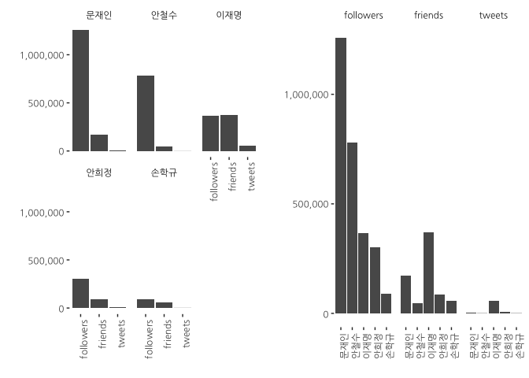
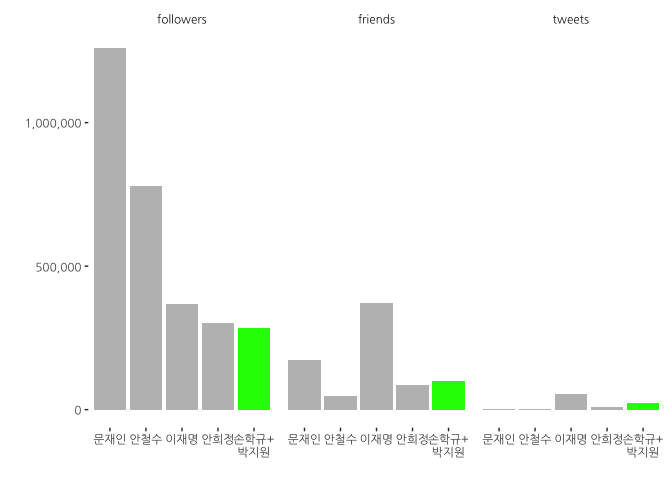
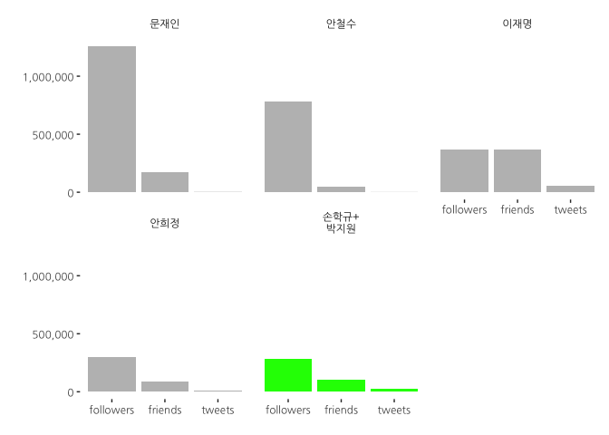

# 데이터 과학자와 함께 하는 제19대 대통령 선거

## JTBC 여론조사에 반영하지 못한 것

### JTBC 대선주자 지지율

반기문 후보 사퇴 후 JTBC가 실시한 긴급 여론조사에 따라 문재인 대세론이 굳혀지는 것으로 발표를 했다.
수차례 여론조사의 한계에 대한 지적이 있었고, 정확하지 못한 정보를 제공하여 민심이 잘못 반영되는 문제점은
**가짜 뉴스**라는 이름으로 최근 본격적으로 제기되고 있다. [^survey-fail01] [^survey-fail02]

여론조사가 혹시 빠뜨린 점이 있지 않나 싶어 SNS 계정 중 하나인 **트위터** 데이터를 활용하여 새로운 여론조사의 방안을 모색한다.

[^survey-fail01]: [실제보다 여당이 높게 보이는 여론조사의 비밀](http://www.mediatoday.co.kr/?mod=news&act=articleView&idxno=129177)
[^survey-fail02]: [4‧13 총선, 여론조사가 빗나간 세 가지 이유](http://www.mediatoday.co.kr/?mod=news&act=articleView&idxno=129414)

## 트위터 데이터 분석 결과

### 트위터 계정 보유 현황

JTBC 여론조사 대선후보를 중심으로 트위터 계정은 네이버 인물검색 시 프로필에 나오는 트위터 공식 계정을 활용했다.
여론조사에서 언급되는 대선 후보 중에 트위터 계정이 없거나 거의 트위터에서 회자되고 있지 않는 후보도 있고,
유력 대선주사 못지 않는 트위터 팔로워와 트윗을 자랑하는 정치인도 있다.

- [문재인](https://search.naver.com/search.naver?where=nexearch&query=%EB%AC%B8%EC%9E%AC%EC%9D%B8&sm=top_hty&fbm=1&ie=utf8): @moonriver365
- [안철수](https://search.naver.com/search.naver?where=nexearch&query=안철수&sm=top_hty&fbm=1&ie=utf8): @cheolsoo0919
- [안희정](https://search.naver.com/search.naver?where=nexearch&query=안희정&sm=top_hty&fbm=1&ie=utf8): @steelroot
- [이재명](https://search.naver.com/search.naver?where=nexearch&query=이재명&sm=top_hty&fbm=1&ie=utf8): @Jaemyung_Lee
- [손학규](https://search.naver.com/search.naver?where=nexearch&query=손학규&sm=top_hty&fbm=1&ie=utf8): @HQ_Sohn
- [유승민](https://search.naver.com/search.naver?where=nexearch&query=유승민&sm=top_hty&fbm=1&ie=utf8): 트위터 계정 없음
- [남경필](https://search.naver.com/search.naver?where=nexearch&query=남경필&sm=top_hty&fbm=1&ie=utf8): 트위터 계정 없음
- [황교안](https://search.naver.com/search.naver?where=nexearch&query=황교안&sm=top_hty&fbm=1&ie=utf8): 트위터 계정 없음
- [박지원](https://search.naver.com/search.naver?where=nexearch&query=%EB%B0%95%EC%A7%80%EC%9B%90&sm=top_hty&fbm=1&ie=utf8): @jwp615
- [김종인](https://search.naver.com/search.naver?where=nexearch&query=%EA%B9%80%EC%A2%85%EC%9D%B8&sm=top_hty&fbm=0&ie=utf8): 트위터 계정 없음

### 단순 트위터 계정기준 지지도 분석

트위터 계정 기준 팔로워, 친구수, 트윗수 등을 기준으로 보면 단연 **문재인** 후보가 가장 많은 팔로우를 갖고 있으나,
트윗을 보면 **이재명** 후보도 성남시장이라는 한계를 감안하면 상당한 영향력을 보이는 것으로 파악된다.

트위터 활동을 하지 않는 후보는 거의 활동이 미미하고 **손학규** 후보의 경우도 상당히 뒤쳐지는 것으로 나타난다.

~~~{.output}
[1] "Using direct authentication"

~~~

<!--html_preserve-->

<!--/html_preserve-->

### 손학규 후보와 박지원 연대 시나리오

정치는 생물이라 언론에서 회자되는 손학규 후보 국민주권개혁회의와 박지원 국민의당 통합 시나리오를 상정할 경우 
트위터 데이터 변화는 다음과 같다. **손학규** 후보가 다크호스로 부각된다.

<!--html_preserve-->

<!--/html_preserve-->

